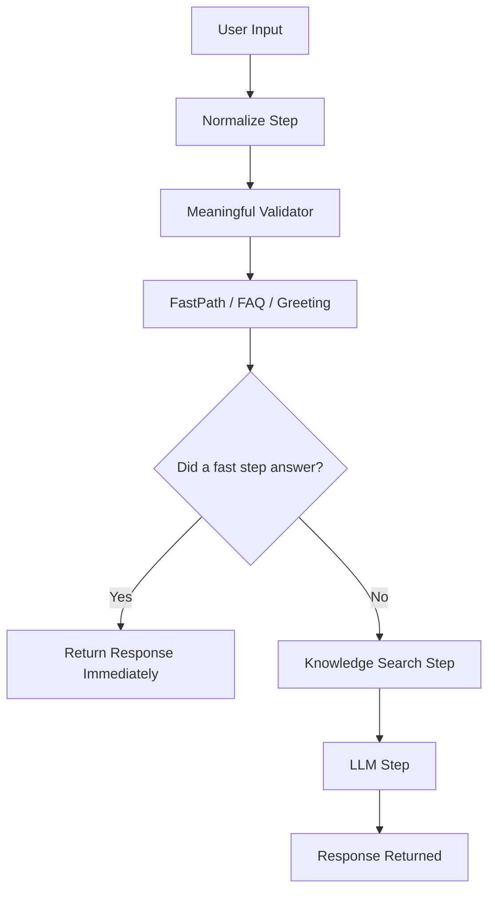
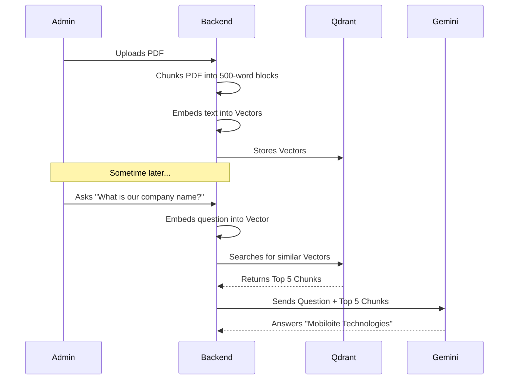
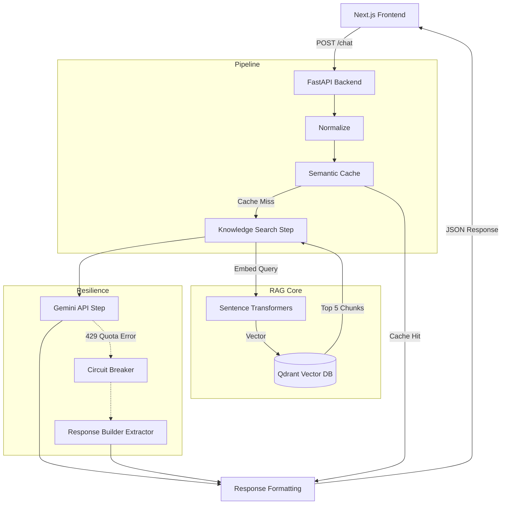

# Enterprise Chatbot: Complete Project Documentation

Welcome to the team! This document is designed for new developers (Day 1 onboarding). It will take you step-by-step through the entire project, explaining **what** everything is, **why** it was built, and **how** it works under the hood. 

By the time you finish reading this, you will completely understand the entire system architecture, from the moment a user clicks "Send" on the frontend, to how the backend processes it using AI, and how the response gets back.

---

## 1. Project Overview

**What is this project?**
This is an Enterprise Conversational AI Chatbot with a custom Knowledge Base (RAG - Retrieval-Augmented Generation). 

**Why was it built?**
To provide users (employees, customers, or admins) with an intelligent assistant that can answer questions strictly based on internal company documents (PDFs, policies, profiles) without hallucinating or making up answers.

**Who will use it?**
- **End Users**: To chat with the AI and get accurate answers.
- **Admins**: To upload new documents (PDFs), monitor metrics, and adjust system settings via the Admin Panel.
- **Developers**: To debug the pipeline using the built-in "Developer Mode".

**Architecture Type**
Client-Server Microservices Architecture.
- Client: Next.js (React) Frontend.
- Server: FastAPI (Python) Backend.
- Database: Neon PostgreSQL & Qdrant Vector Store.

**Folder Structure (High-Level)**
- `/frontend`: Contains the entire UI, Next.js routes, and Tailwind styles.
- `/backend`: Contains the FastAPI server, AI pipeline, RAG logic, and database models.

---

## 2. Technology Stack

### Frontend
- **Next.js (App Router)**: The core React framework used to build the frontend. It allows for server-side rendering, fast routing, and API proxying. Used everywhere in `/frontend/src/app`.
- **React & TypeScript**: Used for building UI components with strict type-safety.
- **Tailwind CSS**: A utility-first CSS framework for styling. Used to create the premium, glassmorphism design.
- **Lucide React**: Used for SVG icons (like settings, upload, send buttons).

### Backend
- **FastAPI**: A modern, extremely fast web framework for building Python APIs. It handles all incoming requests. Main entry point: `backend/app.py`.
- **Python**: The core language for the backend, perfect for AI and data processing.
- **Pydantic**: Used for data validation. When the frontend sends JSON, Pydantic ensures it has the correct fields (e.g., `MessageRequest`).

### AI & Data
- **Qdrant**: A Vector Database. When we upload a PDF, we turn the text into numbers (vectors) and store them here. Qdrant is incredibly fast at finding "similar" text.
- **Sentence Transformers (MiniLM-L6-v2)**: An open-source model used to convert text sentences into vectors (embeddings). Runs completely locally on the backend.
- **Gemini (Google AI)**: The Large Language Model (LLM). It takes the user's question and the retrieved PDF text and writes a natural, conversational answer.
- **SQLAlchemy & Neon Postgres**: A relational database used to store Chat History, Cached Responses, and Analytics.

---

## 3. Folder Structure (Deep Dive)

### Backend (`/backend`)
- **`app.py`**: The main entry point. Starts the FastAPI server, loads CORS, and registers all routers.
- **`api/routes/`**: Contains the API endpoints.
  - `chat.py`: The `/chat` endpoint. Receives user messages and passes them to the Pipeline.
  - `knowledge.py`: Endpoints for uploading PDFs and viewing chunks.
  - `dashboard.py`: Endpoints for analytics.
- **`core/`**: Configuration and singletons.
  - `config.py`: Loads `.env` variables.
  - `circuit_breaker.py`: **[CRITICAL]** Protects the system if the Gemini API goes down.
  - `database.py`: Connects to Neon Postgres.
- **`pipeline/`**: The brain of the chatbot.
  - `pipeline_runner.py`: Executes a sequence of "Steps" (Normalize -> FastPath -> Knowledge Search -> LLM).
- **`steps/`**: Individual blocks of logic for the pipeline.
  - `knowledge_search_step.py`: Queries Qdrant for similar text.
  - `llm_step.py`: Calls Gemini to generate the final response.
- **`services/`**: External integrations.
  - `rag/retriever.py`: Logic for searching Qdrant.
  - `llm/providers/gemini_provider.py`: The actual code that calls the Google Gemini API.

### Frontend (`/frontend/src`)
- **`app/`**: Next.js App Router.
  - `page.tsx`: The main Chat Interface.
  - `admin/page.tsx`: The admin dashboard layout.
- **`components/`**: Reusable UI blocks.
  - `chat/DeveloperSidebar.tsx`: The right-side panel showing pipeline execution metrics.
  - `chat/ChatBubble.tsx`: Renders individual messages.

---

## 4. Frontend Flow

**How the Frontend Starts:**
Running `npm run dev` starts the Next.js Turbopack server on `localhost:3000`.

**Main Chat Page (`src/app/page.tsx`)**
When a user visits the root `/`, they see the chat UI.
1. The user types a message and clicks send.
2. The `sendMessage` function is triggered.
3. It adds the user's message to the React state (so it appears on screen immediately).
4. It sends a `POST` request to `/api/chat` (which Next.js proxies to the Python backend on port 8000).
5. While waiting, a "Typing..." indicator is shown.
6. When the backend replies, the UI updates with the AI's message and the Developer Sidebar updates with the execution graph.

**Developer Mode**
A unique feature of this project. On the right side of the screen, developers can see exactly how long the backend took, which pipeline steps executed, and if the LLM failed and used a fallback.

---

## 5. Backend Flow

**FastAPI Startup**
Running `python app.py` starts the Uvicorn server on `localhost:8000`.
During startup, `app.py` triggers the `lifespan` context manager, which initializes the database connection and prepares the API routes.

**How Requests are Handled**
1. Request hits `chat.py`.
2. `chat.py` initializes a `PipelineContext` (a shared memory object for the request).
3. It calls `PipelineRunner.run()`.
4. The PipelineRunner executes a strict sequence of steps.
5. The final output is serialized into JSON and returned to the frontend.

---

## 6. Pipeline Architecture

The pipeline is a sequential chain of steps. This allows us to easily add or remove features without breaking the entire codebase.

**Steps:**
1. **NormalizeStep**: Converts text to lowercase, removes extra spaces.
2. **ConversationOpenerStep**: Detects greetings ("hi", "hello"). If true, responds instantly without calling the LLM.
3. **GibberishStep**: Detects keyboard mashing ("asdasd"). If true, politely asks the user to rephrase.
4. **KnowledgeSearchStep**: Searches Qdrant for matching PDF chunks.
5. **LLMStep**: Calls Gemini to generate a response. If Gemini fails, it triggers the Fallback.

---

## 7. RAG (Retrieval-Augmented Generation) Architecture

**Why RAG?** LLMs don't know your private company data. RAG solves this by "Retrieving" documents and giving them to the LLM to "Generate" an answer.

---

## 8. Knowledge Base & Upload Flow

**Where files are stored:** 
When an admin uploads a file via the Admin Panel (`/admin/knowledge`), the backend (`knowledge.py`) receives it.

**Chunking:**
The text is extracted from the PDF and split into "chunks" (small paragraphs of ~500 characters). This is critical because you cannot send a 10,000-page PDF to an LLM directly; it's too big and too expensive.

**Embedding:**
Each chunk is passed to `sentence-transformers` which converts the text into a massive array of numbers (e.g., `[0.12, -0.45, 0.88...]`). These numbers represent the *semantic meaning* of the text.

---

## 9. Qdrant (Vector Database)

**Purpose:** Qdrant is specifically built to store and search arrays of numbers (vectors).
- **Collections**: Similar to tables in SQL. We use a collection named `enterprise_knowledge`.
- **Similarity Search**: When a user asks a question, we embed the question into a vector. Qdrant uses "Cosine Similarity" to find which document vectors are mathematically closest to the question vector.
- **Threshold**: `HARD_MIN_THRESHOLD = 0.40`. If the closest document has a similarity score lower than 0.40, we assume it's irrelevant and reject it.

---

## 10. Gemini Integration & Graceful Degradation

**File**: `backend/steps/llm_step.py`

When the RAG system finds relevant chunks, it sends them to Gemini along with a strict prompt:
> *"You are a strict enterprise AI assistant. You MUST answer ONLY using the provided context."*

**Quota Handling & Graceful Degradation:**
If the Gemini API key runs out of quota, it returns an HTTP 429 Error. 
Instead of crashing and showing a "500 Internal Server Error" to the user, our `LLMStep` explicitly catches this error.
It falls back to a custom **Knowledge Response Builder** (`response_builder.py`). This builder manually extracts the 1-3 most relevant sentences from the retrieved chunks (max 80 words) and returns that directly to the user. The user still gets a factual answer, and the backend survives!

---

## 11. Semantic Cache

**Purpose**: To save money on LLM API calls and make responses instant.
**Flow**:
1. User asks "What is the company name?"
2. System processes it, calls Gemini, and gets the answer.
3. System hashes the normalized question (`hashlib.sha256`) and saves the Answer to Postgres (`ChatCacheDB`).
4. Tomorrow, another user asks "What is the company name?"
5. The `SemanticCacheStep` sees the exact hash in Postgres.
6. It returns the answer instantly (2 milliseconds) without calling Qdrant or Gemini!

---

## 12. FastPath, Greetings, FAQ, Gibberish

**FastPath**: A hardcoded list of direct answers. If a user asks "contact", the system intercepts it and returns the HR email instantly.
**Greetings**: Uses regex and keywords to catch "hi", "hello", "good morning".
**Gibberish**: Detects inputs with no vowels or massive random consonants (`asjdhfkjasd`) and rejects them before wasting LLM tokens.

---

## 13. Developer Mode

Located on the right side of the chat interface (`DeveloperSidebar.tsx`).
It provides absolute transparency into the AI's brain.
- **Trace Metrics**: Shows every single pipeline step that executed, and exactly how many milliseconds it took.
- **LLM Status**: Shows if Gemini was used, or if a Fallback was used due to API limits.
- **Retrieval Score**: Shows the exact cosine similarity score of the chunks Qdrant found.

---

## 14. API Documentation

| Method | Endpoint | Purpose |
|--------|----------|---------|
| POST | `/chat` | Main endpoint. Accepts `{message: "str"}`. Returns AI response and trace metadata. |
| GET | `/admin/knowledge` | Lists all indexed chunks in Qdrant. |
| POST | `/admin/knowledge/upload` | Uploads a PDF to be chunked and vectorized. |
| GET | `/dashboard/analytics` | Returns total calls, cache hits, and latency stats. |

---

## 15. Database (Neon Postgres)

We use SQLAlchemy as our ORM.
- `conversations`: Tracks unique chat sessions.
- `messages`: Stores every message sent by the user and the assistant.
- `memory_facts`: Stores extracted facts (future-proofing for personalized AI).
- `chat_cache`: Stores the Semantic Cache (Question Hash -> Answer).

---

## 16. Error Handling

- **429 (Too Many Requests)**: Caught by `llm_step.py`. Triggers the `CircuitBreaker` and falls back to chunk extraction.
- **500 (Internal Server Error)**: Handled by the global exception handler in `app.py`. Returns a clean JSON error instead of crashing Uvicorn.
- **Circuit Breaker**: Found in `circuit_breaker.py`. If Gemini fails 3 times in a row, the circuit "OPENS". For the next 60 seconds, all LLM calls are bypassed instantly to prevent the backend from hanging or being rate-limited further.

---

## 17. Manager Interview Questions

If your manager grills you on this architecture, here is how you answer confidently:

**Q1: Why did we choose FastAPI instead of Django/Flask?**
**A**: FastAPI is built on modern Python features (asyncio) and Pydantic. It is significantly faster than Flask, natively supports asynchronous requests (which is critical when waiting for LLM API calls), and automatically generates Swagger UI documentation.

**Q2: Why use Qdrant instead of just standard SQL matching?**
**A**: SQL relies on exact keyword matching. Qdrant is a Vector Database. It understands the *meaning* of words. If a user searches for "compensation", Qdrant will successfully find a document about "salary" because their vectors are mathematically similar. SQL would fail.

**Q3: How do we prevent the LLM from hallucinating?**
**A**: We use strict RAG prompting. We inject the PDF context into the prompt and explicitly instruct the LLM: *"You MUST answer ONLY using the provided context. Do not add external knowledge."*

**Q4: What happens if our Gemini API limit is reached during a busy day?**
**A**: We implemented a Circuit Breaker and a Graceful Degradation mechanism. If Gemini throws a 429 error, the pipeline catches it and falls back to our `ContextResponseBuilder`, which extracts the most relevant sentences directly from the Qdrant chunks. The user never sees an error, and the server doesn't crash.

**Q5: Why did we build a Pipeline architecture instead of just one big function?**
**A**: Maintainability. By splitting logic into Steps (Normalize -> FastPath -> Search -> LLM), we can easily disable features, inject caching layers in the middle, and unit test individual components without touching the rest of the code.

**Q6: What is the purpose of the Semantic Cache?**
**A**: It prevents us from paying for the same question twice. If 50 employees ask "What are the working hours?", the first one triggers an LLM call. The next 49 hit the database hash cache and return in 2 milliseconds, saving both API costs and LLM latency.

---

## 18. Summary / Elevator Pitch (2 Minutes)

"We built an Enterprise Conversational AI that acts as a secure, intelligent assistant for our internal documents. The frontend is built with Next.js for a lightning-fast, premium user experience. When a user asks a question, the request hits our Python FastAPI backend, which runs through a modular pipeline. 

Instead of relying on an LLM's public knowledge, we use RAG (Retrieval-Augmented Generation). The system searches our Qdrant Vector Database for the most relevant internal PDF chunks, and feeds them to Google Gemini to formulate a precise, factual answer. 

To ensure enterprise-grade stability, we implemented a Semantic Cache to instantly answer repeated questions, and a robust Circuit Breaker that gracefully degrades to manual text extraction if the AI provider goes down—ensuring 100% uptime and zero visible errors for our end users."

---

## 19. Final Architecture Diagram

---
*End of Documentation. Welcome to the team!*
