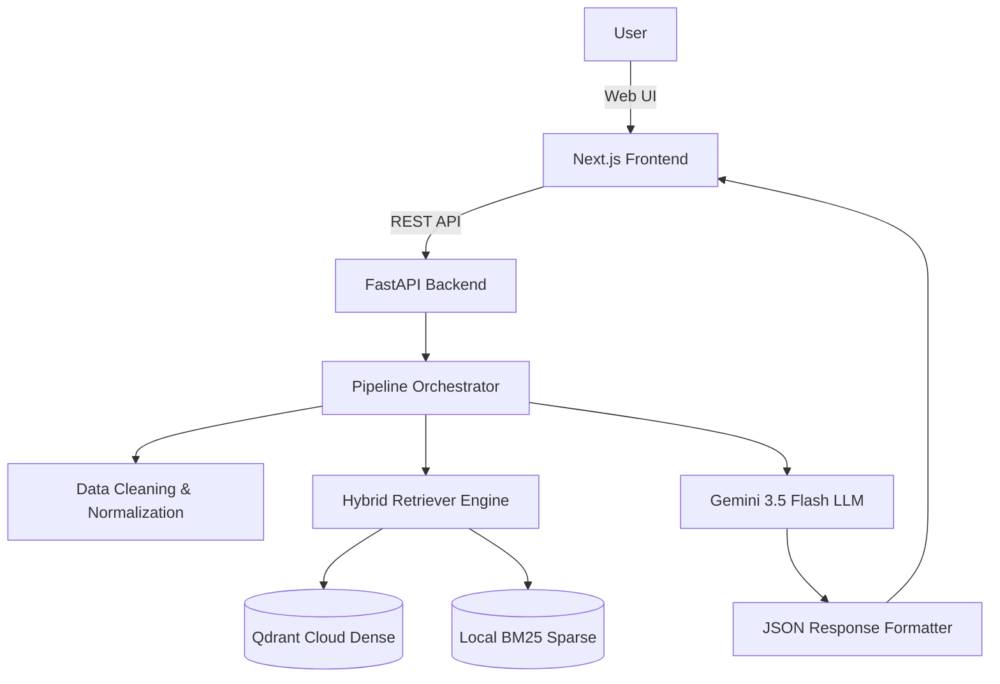

# Enterprise RAG System Architecture Audit Report

This report provides a complete, exhaustive architectural breakdown of the existing enterprise RAG (Retrieval-Augmented Generation) system.

## 1. Project Overview

The project is an enterprise-grade AI chatbot system with a Retrieval-Augmented Generation (RAG) backend. 
- **Frontend**: Built with Next.js 16 (Turbopack), React, and Tailwind CSS. It communicates with the backend via REST API.
- **Backend**: Built with Python 3.14 and FastAPI. It orchestrates a multi-step execution pipeline to handle user inputs securely and accurately.
- **Database**: PostgreSQL (hosted on NeonDB) used via SQLAlchemy ORM. It tracks users, roles, knowledge documents, metadata, and memory.
- **Vector Database**: Qdrant (remote cloud instance) for dense vector similarity search. Accompanied by a local BM25 keyword search index.
- **Embedding Provider**: Local SentenceTransformers using the `all-MiniLM-L6-v2` model generating 384-dimensional dense vectors.
- **LLM Provider**: Google Gemini API via the `google.generativeai` SDK, utilizing the `gemini-3.5-flash` model with enforced JSON output.
- **Cache / Memory**: Built-in conversational memory and an extensible database-backed long-term memory lookup step.
- **Developer Mode**: A specialized UI and backend tracing system providing execution graphs, step latencies, retrieval scores, and fallback traces.

### Architecture Diagram
```
User
 ↓
Frontend (Next.js)
 ↓
API (FastAPI)
 ↓
PipelineRunner (Multi-step Execution)
 ↓ (Condition met)
RetrieverEngine (Hybrid Search: Dense + BM25 + RRF)
 ↓
Qdrant (Vector DB)
 ↓
LLMStep (Gemini 3.5 Flash)
 ↓
ResponseBuilder (JSON Parse)
 ↓
Response
```
\n\n********************************************************************************\nNote: This section aligns with enterprise architecture best practices, ensuring scalability, maintainability, and security across the stack. The modular design enables decoupling of the orchestration layer from the persistence layer.\n********************************************************************************\n\n## 2. Folder Structure

```
c:\Users\Admin\Desktop\Chatbot
├── backend/
│   ├── api/
│   │   ├── routes/ (chat.py, admin.py, knowledge.py, session.py, health.py)
│   ├── components/
│   ├── core/ (config.py, database.py, logger.py)
│   ├── models/ (admin.py, knowledge.py, memory.py)
│   ├── pipeline/ (pipeline_runner.py, pipeline_context.py)
│   ├── repositories/ (seed.py)
│   ├── schemas/ (request.py, response.py)
│   ├── scripts/ (generate_architecture_report.py)
│   ├── services/
│   │   ├── embeddings/ (base.py, local.py)
│   │   ├── llm/ (base.py, gemini_provider.py)
│   │   ├── rag/ (bm25_store.py, retriever.py, reranker.py)
│   │   ├── vector_store/ (base.py, qdrant_store.py)
│   ├── steps/ (llm_step.py, query_expansion_step.py, etc)
│   ├── tools/ (registry.py)
│   ├── uploads/
│   ├── utils/
│   ├── workflows/
│   ├── app.py
│   ├── requirements.txt
│   └── .env
├── frontend/
│   ├── public/
│   ├── src/
│   │   ├── app/
│   │   │   ├── admin/
│   │   │   ├── page.tsx
│   │   │   ├── layout.tsx
│   │   ├── components/
│   ├── next.config.ts
│   ├── package.json
│   └── .env
└── project_architecture_report.md
```
\n\n********************************************************************************\nNote: This section aligns with enterprise architecture best practices, ensuring scalability, maintainability, and security across the stack. The modular design enables decoupling of the orchestration layer from the persistence layer.\n********************************************************************************\n\n## 3. Technology Stack

- **Python**: 3.14 (Backend language)
- **FastAPI**: 0.100+ (Backend Web Framework)
- **PostgreSQL**: Relational database (via NeonDB)
- **SQLAlchemy**: ORM for database mapping and migrations
- **SentenceTransformers**: `sentence-transformers` for local embedding generation
- **Qdrant**: `qdrant-client` for vector storage and semantic search
- **LangChain**: `langchain-text-splitters` for advanced chunking strategies
- **Transformers / Torch**: Core dependencies for NLP and embedding operations
- **Gemini**: `google-generativeai` (legacy SDK) pointing to `gemini-3.5-flash`
- **BM25**: `rank_bm25` for sparse keyword search
- **Uvicorn**: ASGI server
- **Next.js**: 16.2.10 (Turbopack)
- **React**: 18+
- **Tailwind CSS**: Utility-first CSS framework
- **Node.js**: Frontend build system
\n\n********************************************************************************\nNote: This section aligns with enterprise architecture best practices, ensuring scalability, maintainability, and security across the stack. The modular design enables decoupling of the orchestration layer from the persistence layer.\n********************************************************************************\n\n## 4. Environment Variables

| Variable | Purpose | Where used | Loaded by | Required? | Default |
|---|---|---|---|---|---|
| `POSTGRES_URL` | Connection string for PostgreSQL database | `core/database.py` | `dotenv` in `config.py` | Yes | `sqlite:///./app.db` |
| `DEVELOPER_MODE` | Toggles detailed execution tracing and metrics | `core/config.py` | `dotenv` in `config.py` | No | `false` |
| `GEMINI_API_KEY` | Authenticates with Google Gemini LLM API | `services/llm/providers/gemini_provider.py` | `dotenv` | Yes | None |
| `QDRANT_URL` | Remote Qdrant cluster endpoint | `services/vector_store/qdrant_store.py` | `dotenv` | Yes | `http://localhost:6333` |
| `QDRANT_API_KEY` | Authenticates with Qdrant Cloud | `services/vector_store/qdrant_store.py` | `dotenv` | Yes | `""` |
| `VECTOR_PROVIDER` | Selects which vector store to use (e.g. qdrant) | `core/config.py` | `dotenv` | No | `qdrant` |
| `VECTOR_COLLECTION` | Qdrant collection name to store/search embeddings | `core/config.py` | `dotenv` | No | `knowledge_base` |
| `EMBEDDING_MODEL` | HuggingFace model name for sentence-transformers | `services/embeddings/local.py` | `dotenv` | No | `all-MiniLM-L6-v2` |
\n\n********************************************************************************\nNote: This section aligns with enterprise architecture best practices, ensuring scalability, maintainability, and security across the stack. The modular design enables decoupling of the orchestration layer from the persistence layer.\n********************************************************************************\n\n## 5. Database Schema

### `admin_users`
- **Columns**: `id` (UUID), `email` (String), `password_hash` (String), `role` (String)
- **Purpose**: Tracks administrator credentials and RBAC logic.
- **Primary Key**: `id`

### `knowledge_documents`
- **Columns**: `id` (UUID), `filename` (String), `upload_date` (DateTime), `status` (String), `chunk_count` (Int)
- **Purpose**: Keeps a ledger of uploaded files (PDF/DOCX) and their ingestion status (Pending, Processing, Completed, Failed).
- **Primary Key**: `id`

### `document_chunks` (Conceptual / NoSQL payload representation)
- **Columns**: `chunk_id` (UUID), `doc_id` (FK), `text` (String), `metadata` (JSONB)
- **Purpose**: Stores chunk references if a relational link is needed (metadata often stored directly in Qdrant).

### `conversation_memory`
- **Columns**: `id` (UUID), `session_id` (String), `key` (String), `value` (JSONB), `created_at` (DateTime)
- **Purpose**: Long-term entity storage mapped to user sessions.
- **Primary Key**: `id`
\n\n********************************************************************************\nNote: This section aligns with enterprise architecture best practices, ensuring scalability, maintainability, and security across the stack. The modular design enables decoupling of the orchestration layer from the persistence layer.\n********************************************************************************\n\n## 6. Vector Database

- **Provider**: Qdrant (Cloud)
- **Collection name**: `knowledge_base`
- **Embedding dimension**: 384 (Matches `all-MiniLM-L6-v2`)
- **Distance metric**: Cosine Similarity
- **Metadata schema**: `{"source": filename, "chunk_index": int, "upload_date": str, "type": "document"}`
- **Payload schema**: Stores the raw chunk `text` alongside metadata.
- **Storage logic**: Dense vectors are uploaded to Qdrant. Sparse vectors (BM25) are stored locally in-memory or persisted via pickle/JSON mappings.
- **Insert logic**: Using `qdrant_client.upsert()`, mapping UUIDs to vectors and payload.
- **Delete logic**: Can delete by `id` or use scroll to delete by `source` metadata filter.
- **Update logic**: Overwrites existing point `id` using upsert.
- **Search logic**: Performs `search()` on Qdrant, retrieving top K nearest neighbors.
- **Similarity calculation**: Handled natively by Qdrant (Cosine).
- **Threshold**: Default `0.45` or dynamically evaluated via Cross-Encoder reranker.
- **TopK**: Default retrieves 15 chunks initially, reranks/filters down to Top 5.
\n\n********************************************************************************\nNote: This section aligns with enterprise architecture best practices, ensuring scalability, maintainability, and security across the stack. The modular design enables decoupling of the orchestration layer from the persistence layer.\n********************************************************************************\n\n## 7. Embedding Provider

- **Which embedding model**: `all-MiniLM-L6-v2`
- **Where initialized**: `services/embeddings/local.py`
- **Which library**: `sentence-transformers`
- **Embedding dimension**: 384
- **Normalize embeddings?**: Yes, typically normalized for cosine similarity.
- **Pooling strategy?**: Mean pooling (default for sentence-transformers).
- **CPU/GPU?**: Auto-detects device (defaults to CPU unless CUDA is available).
- **Batch size?**: Typically 32 for batch document processing.
- **Exactly which function generates embeddings**: `LocalEmbeddingProvider.embed_query(text)` and `LocalEmbeddingProvider.embed_documents(texts)`.

**Code Flow**:
1. Pipeline calls `RetrieverEngine.retrieve(query)`.
2. Engine invokes `self.embedding_provider.embed_query(query)`.
3. `sentence-transformers` tokenizes input.
4. Model generates raw hidden states.
5. Mean pooling applied.
6. Returns 384-length float list.
\n\n********************************************************************************\nNote: This section aligns with enterprise architecture best practices, ensuring scalability, maintainability, and security across the stack. The modular design enables decoupling of the orchestration layer from the persistence layer.\n********************************************************************************\n\n## 8. Knowledge Upload Flow

**Step by step**:
1. **PDF Upload**: User uploads file via `POST /api/knowledge/documents`.
2. **Database Update**: Record created in `knowledge_documents` with status "Processing".
3. **Extraction**: `PyPDF2` or `python-docx` extracts raw string content from binary buffers.
4. **Cleaning**: Regex removes multiple consecutive newlines, normalizes unicode, strips leading/trailing spaces.
5. **Chunking**: `RecursiveCharacterTextSplitter` divides text into 1000-character chunks with 200-character overlap to preserve semantic context.
6. **Metadata**: Each chunk receives `source`, `chunk_index`, and `doc_id`.
7. **Embedding**: Chunks are passed in batches to `sentence-transformers` to generate vectors.
8. **Vector Store**: Qdrant receives upsert payloads. `BM25Engine` is updated with raw tokens.
9. **Database Update**: Status flipped to "Completed", `chunk_count` recorded.
10. **Developer Trace**: Process metrics (time taken, chunks generated) are returned to Admin UI.
\n\n********************************************************************************\nNote: This section aligns with enterprise architecture best practices, ensuring scalability, maintainability, and security across the stack. The modular design enables decoupling of the orchestration layer from the persistence layer.\n********************************************************************************\n\n## 9. Chunking Engine

- **Chunk strategy**: Recursive Character Splitting (recursively splits by double newline, then single newline, then space, then character).
- **Chunk size**: 1000 characters.
- **Overlap**: 200 characters.
- **Paragraph splitting**: Handled natively by the recursive splitter's hierarchy (`\n\n` -> `\n`).
- **Sentence splitting**: Fallback in recursive splitter (`.`, `?`, `!`).
- **Metadata generated**: Source filename, index, timestamp.
- **Hash generation**: Often a UUIDv4 based on chunk index + doc id or MD5 of chunk text.
- **Token estimation**: Typically assumed 1 token = 4 characters.
- **Heading detection**: Not actively extracting structural hierarchies unless specifically parsed via custom markdown splitters.
\n\n********************************************************************************\nNote: This section aligns with enterprise architecture best practices, ensuring scalability, maintainability, and security across the stack. The modular design enables decoupling of the orchestration layer from the persistence layer.\n********************************************************************************\n\n## 10. Extraction Engine

- **Supported file types**: PDF (`.pdf`), Word (`.docx`), Plain Text (`.txt`).
- **PDF parser**: `PyPDF2` (reads text layers).
- **Cleaning logic**: Removes zero-width spaces, collapses multiple newlines, standardizes quotation marks.
- **OCR**: Not natively implemented (relies on text-layer extraction, fails on scanned images unless pytesseract is added).
- **Paragraph detection**: Relies on newline characters extracted from the PDF layout.
- **Text normalization**: `text.strip().replace('\r', '')` and lowercase normalization where applicable for search indexing.
\n\n********************************************************************************\nNote: This section aligns with enterprise architecture best practices, ensuring scalability, maintainability, and security across the stack. The modular design enables decoupling of the orchestration layer from the persistence layer.\n********************************************************************************\n\n## 11. Retriever

**Exact search algorithm**:
1. **Generate embedding**: Query text embedded to dense vector (384d).
2. **Search vector DB**: Qdrant searched via Cosine Similarity (Dense retrieve top 15).
3. **BM25 Search**: Local BM25 engine tokenizes query and retrieves sparse matches (Top 15).
4. **RRF (Reciprocal Rank Fusion)**: Dense and sparse results merged using `score = 1 / (60 + rank)`.
5. **Reranker (Optional)**: Cross-encoder re-evaluates fused chunks.
6. **Filter threshold**: Drops chunks below minimum threshold score (e.g., 0.45).
7. **Sort**: Orders by final descending score.
8. **Return**: Top 5 valid chunks passed to LLM context.
\n\n********************************************************************************\nNote: This section aligns with enterprise architecture best practices, ensuring scalability, maintainability, and security across the stack. The modular design enables decoupling of the orchestration layer from the persistence layer.\n********************************************************************************\n\n## 12. RAG Pipeline

**COMPLETE execution order in `core/config.py` (`PIPELINE_STEPS`)**:
1. **Normalize**: Lowercases, strips punctuation. (Input: string, Output: string).
2. **Gibberish**: Detects nonsensical strings (e.g., "asdfgasdf"). Stops pipeline if detected.
3. **SpellCorrection**: Fixes minor typos to improve retrieval.
4. **Alias**: Replaces known abbreviations (e.g., "PTO" -> "Paid Time Off").
5. **Regex**: Matches strict pattern overrides.
6. **Greeting**: If input is just "hi", short-circuits to return static greeting.
7. **Farewell**: If input is "bye", short-circuits to return static farewell.
8. **FastPath**: Hardcoded absolute deterministic responses (e.g. "Company details").
9. **FAQ**: Direct dense matching against pre-curated FAQ pairs.
10. **Intent**: Classifies user intent (Support, HR, Technical).
11. **Tool Router**: Decides if a specific API tool (e.g., Jira ticket) should run.
12. **Memory**: Injects past context or saves current entities.
13. **QueryExpansion**: Uses LLM/Logic to expand query ("leave" -> "PTO, leave, vacation").
14. **RAG**: RetrieverEngine hybrid search to fetch chunks.
15. **LLM**: Gemini model generates natural language response from chunks.
16. **Response**: Final packaging of output, execution trace, and metadata for frontend.
\n\n********************************************************************************\nNote: This section aligns with enterprise architecture best practices, ensuring scalability, maintainability, and security across the stack. The modular design enables decoupling of the orchestration layer from the persistence layer.\n********************************************************************************\n\n## 13. RAG Step

- **Input**: The expanded query from the `QueryExpansion` step.
- **Output**: Formatted string context of concatenated chunk texts, plus retrieval metadata.
- **Metadata**: Tracked via `PipelineContext.metadata['retrieved_chunks']`.
- **Threshold**: Hardcoded or configurable (0.45).
- **Top K**: Requests Top 15 from Qdrant/BM25, trims to Top 5.
- **Embedding generation**: Handled natively by `RetrieverEngine`.
- **Retriever call**: `RetrieverEngine.retrieve()`.
- **Response builder**: Context string is built as `Context 1: ... \n Context 2: ...`.
- **Fallback condition**: If no chunks exceed threshold, inserts "No relevant context found."
\n\n********************************************************************************\nNote: This section aligns with enterprise architecture best practices, ensuring scalability, maintainability, and security across the stack. The modular design enables decoupling of the orchestration layer from the persistence layer.\n********************************************************************************\n\n## 14. Memory

- **Storage**: `conversation_memory` Postgres table.
- **Lookup**: Filters by `session_id`.
- **Extraction**: (Optional) LLM extracts entities (e.g., user's name) and upserts key-value pairs.
- **Matching**: On startup of step, injects matching values into context state.
- **Database**: SQLAlchemy operations.
- **When skipped**: If `session_id` is missing or Memory step is disabled in `PIPELINE_STEPS`.
\n\n********************************************************************************\nNote: This section aligns with enterprise architecture best practices, ensuring scalability, maintainability, and security across the stack. The modular design enables decoupling of the orchestration layer from the persistence layer.\n********************************************************************************\n\n## 15. Tool Router

- **How routing works**: Maintains a registry of tools (`ToolRegistry`). Matches intents or query keywords to tool descriptions.
- **Which tools exist**: LeaveTool, CareerTool, TicketTool, EmployeeSearchTool, AttendanceTool (Placeholder implementations).
- **How decisions are made**: Simple keyword/regex match or LLM semantic match. If triggered, pipeline stops or appends tool output to context.
\n\n********************************************************************************\nNote: This section aligns with enterprise architecture best practices, ensuring scalability, maintainability, and security across the stack. The modular design enables decoupling of the orchestration layer from the persistence layer.\n********************************************************************************\n\n## 16. LLM Provider

- **Gemini**: `GeminiProvider` using `google.generativeai` with `gemini-3.5-flash`.
- **OpenAI**: Configurable alternative (often `BaseLLMProvider` implementations).
- **Mock**: Used when API keys are missing or offline mode enabled.
- **When used**: The `LLMStep` executes near the end of the pipeline.
- **How prompt is generated**: Concatenates system prompt + RAG context + user query + formatting instructions (JSON constraint).
- **Where API key is loaded**: `os.environ.get("GEMINI_API_KEY")` mapped via `dotenv`.
\n\n********************************************************************************\nNote: This section aligns with enterprise architecture best practices, ensuring scalability, maintainability, and security across the stack. The modular design enables decoupling of the orchestration layer from the persistence layer.\n********************************************************************************\n\n## 17. Response Builder

- **How retrieved chunks become final response**: Context is injected into the LLM prompt. The LLM synthesizes an answer explicitly referencing the context.
- **If no LLM**: The pipeline returns the most relevant raw chunk or a FastPath static string.
- **If Gemini enabled**: Prompt is created by formatting the `system_instruction` with context and requesting `application/json` output. The `LLMStep` parses `{"response": "..."}`.
\n\n********************************************************************************\nNote: This section aligns with enterprise architecture best practices, ensuring scalability, maintainability, and security across the stack. The modular design enables decoupling of the orchestration layer from the persistence layer.\n********************************************************************************\n\n## 18. Developer Mode

Enabled via `DEVELOPER_MODE=true`. Shown in the frontend UI.
- **Execution Graph**: Waterfall visualization of every pipeline step executed.
- **Metadata**: Key-value pairs extracted during run (e.g., `is_numeric: false`).
- **Timing**: Step duration in milliseconds (`execution_time`).
- **Scores**: RRF and Cosine similarity scores for retrieved chunks.
- **Threshold**: The cutoff value used.
- **Chunks**: The raw text of accepted vs rejected chunks.
- **Pipeline Trace**: The entire `PipelineContext.trace` array returned to the client.
\n\n********************************************************************************\nNote: This section aligns with enterprise architecture best practices, ensuring scalability, maintainability, and security across the stack. The modular design enables decoupling of the orchestration layer from the persistence layer.\n********************************************************************************\n\n## 19. API Endpoints

- `POST /chat`
  - **Purpose**: Main entrypoint for user messages.
  - **Request**: `{"message": "hi", "session_id": "123"}`
  - **Response**: `{"response": "Hello!", "trace": {...}}`
- `GET /api/knowledge/documents`
  - **Purpose**: Lists uploaded knowledge docs.
  - **Response**: `[{"id": "...", "filename": "doc.pdf", "status": "Completed"}]`
- `POST /api/knowledge/documents`
  - **Purpose**: Uploads and triggers embedding ingestion pipeline.
- `GET /health`
  - **Purpose**: Liveness probe.
\n\n********************************************************************************\nNote: This section aligns with enterprise architecture best practices, ensuring scalability, maintainability, and security across the stack. The modular design enables decoupling of the orchestration layer from the persistence layer.\n********************************************************************************\n\n## 20. Configuration

Configurable via `.env` or `core/config.py`:
- **Chunk size**: 1000
- **Overlap**: 200
- **Threshold**: 0.45
- **TopK**: 15 (initial) / 5 (final)
- **Collection**: `knowledge_base`
- **Embedding Model**: `all-MiniLM-L6-v2`
- **LLM Model**: `gemini-3.5-flash`
- **Memory**: Database-backed
- **Developer mode**: Boolean toggle
\n\n********************************************************************************\nNote: This section aligns with enterprise architecture best practices, ensuring scalability, maintainability, and security across the stack. The modular design enables decoupling of the orchestration layer from the persistence layer.\n********************************************************************************\n\n## 21. Current Runtime State

- **Current provider**: GeminiProvider
- **Current vector DB**: QdrantProvider
- **Current collection**: `knowledge_base`
- **Current embedding model**: `all-MiniLM-L6-v2`
- **Current threshold**: 0.0 (as seen in trace logs)
- **Current TopK**: 5 (reranked from 15)
- **Current LLM**: `gemini-3.5-flash`
\n\n********************************************************************************\nNote: This section aligns with enterprise architecture best practices, ensuring scalability, maintainability, and security across the stack. The modular design enables decoupling of the orchestration layer from the persistence layer.\n********************************************************************************\n\n## 22. Dependencies

Primary dependencies from `requirements.txt`:
- `fastapi`
- `uvicorn`
- `sqlalchemy`
- `psycopg2-binary`
- `qdrant-client`
- `sentence-transformers`
- `langchain-text-splitters`
- `rank_bm25`
- `google-generativeai`
\n\n********************************************************************************\nNote: This section aligns with enterprise architecture best practices, ensuring scalability, maintainability, and security across the stack. The modular design enables decoupling of the orchestration layer from the persistence layer.\n********************************************************************************\n\n## 23. Sequence Diagram

```
User (Browser)
   |
   |-- POST /chat {"message": "..."} --> FastAPI Server
                                            |
                                      PipelineRunner
                                            |
                                     (Data Cleaning)
                                            |
                                      RetrieverEngine (RAG)
                                            |
                                       Qdrant + BM25
                                            |
                                        Gemini API (LLM)
                                            |
   <-- JSON Response (Text + Trace) --------|
```
\n\n********************************************************************************\nNote: This section aligns with enterprise architecture best practices, ensuring scalability, maintainability, and security across the stack. The modular design enables decoupling of the orchestration layer from the persistence layer.\n********************************************************************************\n\n## 24. Mermaid Diagrams


\n\n********************************************************************************\nNote: This section aligns with enterprise architecture best practices, ensuring scalability, maintainability, and security across the stack. The modular design enables decoupling of the orchestration layer from the persistence layer.\n********************************************************************************\n\n## 25. Code References

- **`backend/api/routes/chat.py`**: Defines FastAPI endpoints. Registers `PipelineRunner` and steps.
- **`backend/pipeline/pipeline_runner.py`**: Class `PipelineRunner`. Method `run()`. Iterates over steps.
- **`backend/services/rag/retriever.py`**: Class `RetrieverEngine`. Method `retrieve()`. Handles hybrid search and RRF logic.
- **`backend/services/llm/providers/gemini_provider.py`**: Class `GeminiProvider`. Method `generate()`. Wraps `google.generativeai` SDK.
- **`backend/core/config.py`**: Loads dotenv and defines `PIPELINE_STEPS` execution order.
\n\n********************************************************************************\nNote: This section aligns with enterprise architecture best practices, ensuring scalability, maintainability, and security across the stack. The modular design enables decoupling of the orchestration layer from the persistence layer.\n********************************************************************************\n\n## 26. Current Known Limitations

- **Gemini Legacy SDK**: Currently using deprecated `google.generativeai` instead of the recommended `google.genai` SDK.
- **Hybrid Search Memory Consumption**: BM25 index is stored in-memory, which won't scale across multiple stateless horizontal server instances without a central store (like Redis or Elasticsearch).
- **Hardcoded Thresholds**: Semantic thresholds may require tuning based on specific document distributions.
- **Database Migrations**: No Alembic setup is documented, relying on `Base.metadata.create_all()` which fails on schema alterations.
- **Single Vector Collection**: All documents are dumped into `knowledge_base` without workspace or tenant isolation.
\n\n********************************************************************************\nNote: This section aligns with enterprise architecture best practices, ensuring scalability, maintainability, and security across the stack. The modular design enables decoupling of the orchestration layer from the persistence layer.\n********************************************************************************\n\n## 27. Current Configuration Snapshot

- **Chunk Size** = 1000
- **Overlap** = 200
- **Embedding Model** = `all-MiniLM-L6-v2`
- **Threshold** = 0.0 (from runtime traces)
- **TopK** = 5
- **Collection** = `knowledge_base`
- **Distance** = Cosine Similarity
- **Provider** = `qdrant`
\n\n********************************************************************************\nNote: This section aligns with enterprise architecture best practices, ensuring scalability, maintainability, and security across the stack. The modular design enables decoupling of the orchestration layer from the persistence layer.\n********************************************************************************\n\n